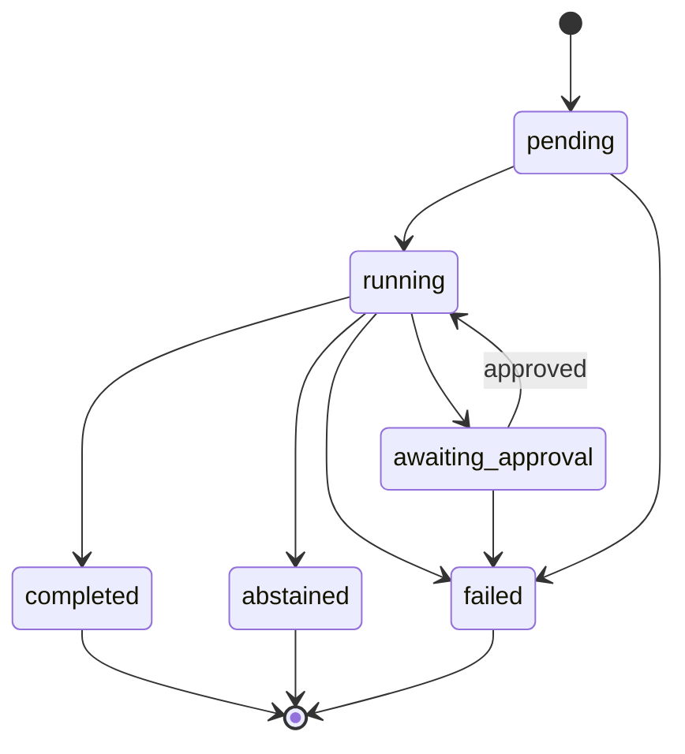

# Run state model

```mermaid
stateDiagram-v2
    [*] --> pending
    pending --> running
    pending --> failed
    running --> completed
    running --> abstained
    running --> failed
    running --> awaiting_approval
    awaiting_approval --> running: approved
    awaiting_approval --> failed
    completed --> [*]
    abstained --> [*]
    failed --> [*]
```

Illegal transitions raise `InvalidTransition` (HTTP 409).
